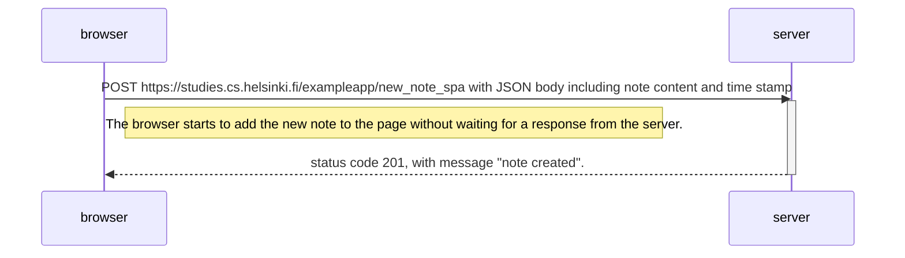

```mermaid
sequenceDiagram
    participant browser
    participant server

    browser->>server: POST https://studies.cs.helsinki.fi/exampleapp/new_note_spa with JSON body including note content and time stamp
    activate server
    Note right of browser: The browser starts to add the new note to the page without waiting for a response from the server.
    server-->>browser: status code 201, with message "note created".
    deactivate server
```